#  Learning Objectives 

+ Here are some of the concepts you will learn in this chapter.
	+ Define and distinguish the terms actions , movements , and neuromotor processes and give examples of each.
	+ Describe the one common motor skill characteristic for each of three motor skill classification systems, the two categories of skills in each system, and examples of skills in each category of each system.
	+ Describe the two dimensions used to classify skills in the Gentile taxonomy of motor skills and the classification characteristic included within each dimension.
	+ Discuss ways to use the Gentile taxonomy of motor skills in physical rehabilitation or physical education and sport contexts.


---
#  Why Study Motor Learning? 


---
#  The Study of Motor Skills: Motor Learning, Control, and Development 

+ Motor learning involves the study of:
+ The acquisition of motor skills.
	+ The performance enhancement of learned or highly experienced motor skills.
	+ The reacquisition of skills following injury, disease, and the like.

---
class: inverse
background-image: url('assets/img/image10.png')
background-size: cover


---
class: inverse
background-image: url('assets/img/image15.png')
background-size: cover


---
class: inverse
background-image: url('assets/img/image7.jpeg')
background-size: cover


---
class: inverse
background-image: url('assets/img/image12.png')
background-size: cover


---
class: inverse
background-image: url('assets/img/image6.jpeg')
background-size: cover


---
class: inverse
background-image: url('assets/img/image14.png')
background-size: cover


---
class: inverse
background-image: url('assets/img/image16.png')
background-size: cover


---
class: inverse
background-image: url('assets/img/image9.png')
background-size: cover


---
class: inverse
background-image: url('assets/img/image11.png')
background-size: cover


---
class: inverse
background-image: url('assets/img/image8.jpeg')
background-size: cover


---
class: inverse
background-image: url('assets/img/image13.png')
background-size: cover


---
class: inverse
background-image: url('assets/img/image17.png')
background-size: cover


---
#  The Study of Motor Skills: Motor Learning, Control, and Development 2 

+ Motor control involves the study of:
		+ How the neuromuscular system functions to activate and coordinate the muscles and limbs involved in the performance of a motor skill.
			+ While learning a new skill.
			+ While performing a well-learned skill.
	+ Motor development involves the study of:
+ Motor behavior and human development from infancy through old age.

---
#  Figure 1.1: Three Influences on How We Perform a Motor Skill 

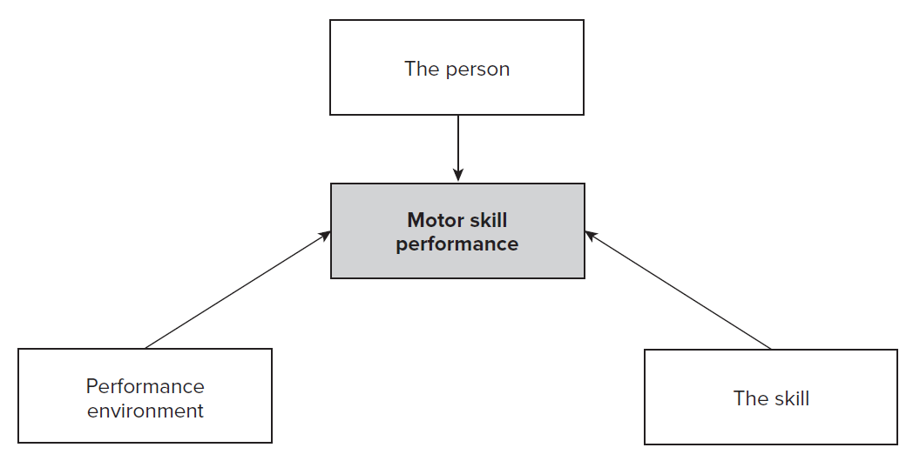

---
#  Skills and Actions 


---
#  Characteristics of Skills and Actions 

+ There is a goal to achieve.
	+ Types of motor skills of interest are performed voluntarily.
	+ Motor skills require movement of joints and body segments to accomplish task goals.
	+ Skills need to be learned, or relearned.


---
#  Movements and Neuromotor Processes  


---
#  Why Distinguish Actions, Movements, and Neuromotor Processes 1 

+ Actions, movements, and neuromotor processes represent the order in which motor control & learning are prioritized.
	+ People initially learn to achieve action goals.
	+ People use a variety of movements to discover the best movement to accomplish the action goal.
	+ People modify neuromotor processes by refining the movement and making it more efficient.
This Photo by Unknown author is licensed under CC BY-ND .
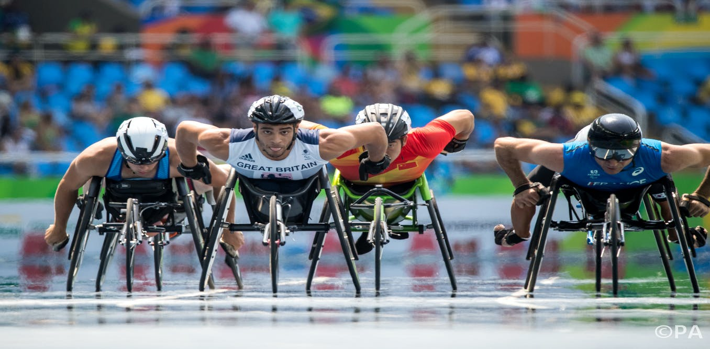
[This Photo](http://theconversation.com/disabled-people-dont-want-to-be-your-inspiration-but-if-they-are-its-no-surprise-65430)
[CC BY-ND](https://creativecommons.org/licenses/by-nd/3.0/)

---
#  Why Distinguish Actions, Movements, and Neuromotor Processes 2 


---
#  Why Classify Motor Skills? 


---
#  One-Dimension System: Size of Primary Musculature Required 

+ With the One-Dimension system, there are two categories.
		+ Gross motor skills : Require the use of large musculature to achieve the goal of the skill.
			+  Example: Walking, jumping, et cetera. 
		+ Fine motor skills : Require control of the small muscles to achieve the goal of the skill.
			+ Example: Skills involving hand-eye coordination.
This Photo by Unknown author is licensed under CC BY-NC-ND .
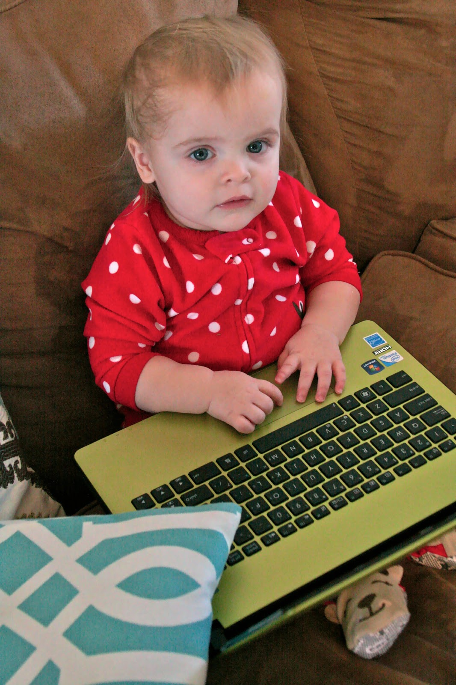
[This Photo](http://www.grass-stains.com/2013/02/the-new-fine-motor-skills.html)
[CC BY-NC-ND](https://creativecommons.org/licenses/by-nc-nd/3.0/)

---
#  One-Dimension System: Specificity of Where Movement of a Skill Begins and Ends 1 

+ Two main categories.
	+ Discrete motor skills : Specified beginning and end points, usually require a simple movement.
		+ Example: Flipping a light switch.
	+ Continuous motor skills : Arbitrary movement beginning and end points; usually involve repetitive movements.
		+ Example: Steering a car.
.pull-left[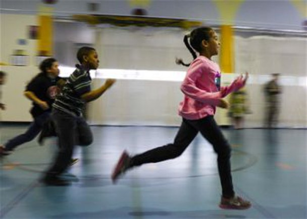]

.pull-right[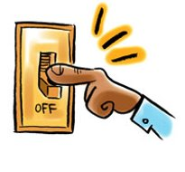]
[](https://courses.lumenlearning.com/wm-lifespandevelopment/chapter/defining-human-development/)

---
#  One-Dimension System: Specificity of Where Movement of a Skill Begins and Ends 2 

+ Combination category: Serial motor skills .
	+ Involve a continuous series of discrete movements.
		+ Example: Shifting gears in a stick shift car.
		+ Playing piano.
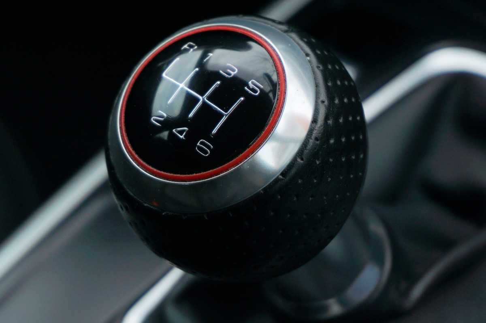

---
#  One-Dimension System: Stability of the Environmental Context 1 

+ Environmental context : The physical location / setting in which a skill is performed.
	+ Three specific features.
		+ Supporting surface.
		+ Objects involved.
		+ Other people or animals.

---
#  One-Dimension System: Stability of the Environmental Context 2 

+ Two main categories.
	+ Closed motor skills : Involve a stationary supporting surface, object, and/or other people/animal; performer determines when to begin the action.
		+ Example: Picking up a cup while seated at a table.
	+ Open motor skills : Performed in an environment in which supporting surfaces, objects, and/or other people or animals are in motion; environmental context in motion determines when to begin the action.
		+ Example: Catching a thrown ball.
.pull-left[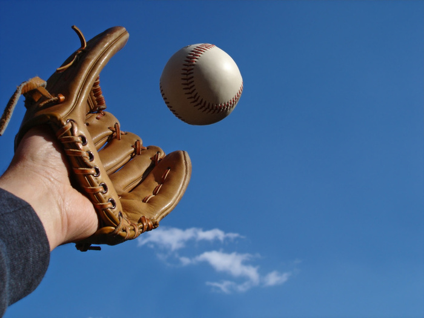]

.pull-right[]
[](http://unfetteredbrilliance.blogspot.com/2012/09/play-ball.html)

---
#  Gentile’s Two-Dimensional Taxonomy 

+ Taxonomy : A classification system that is organized according to relationships among the component characteristics of whatever is being classified.


---
#  Gentile’s Taxonomy of Tasks 1 

+ Environmental context.
	+ Regulatory conditions : Features of environmental context* to which movements must conform to achieve the action goal.
		+ They regulate spatial and temporal aspects of the movement as well as the forces that underlie these characteristics.
		+ *Objects, surfaces, or other people.
+ Nonregulatory conditions : Features of environment that have no influence or only an indirect influence on movement characteristics.

---
#  Gentile’s Taxonomy of Tasks 2 

+ Environmental context.
	+ Intertrial variability : Variations in the regulatory conditions associated with the performance of a skill change or stay the same from one trial to the next.
	+ Example: When someone walks through a room several times in which various objects are located in different places each time because each walk through requires the person to walk with different movements to avoid colliding with the objects.
This Photo by Unknown author is licensed under CC BY-SA .
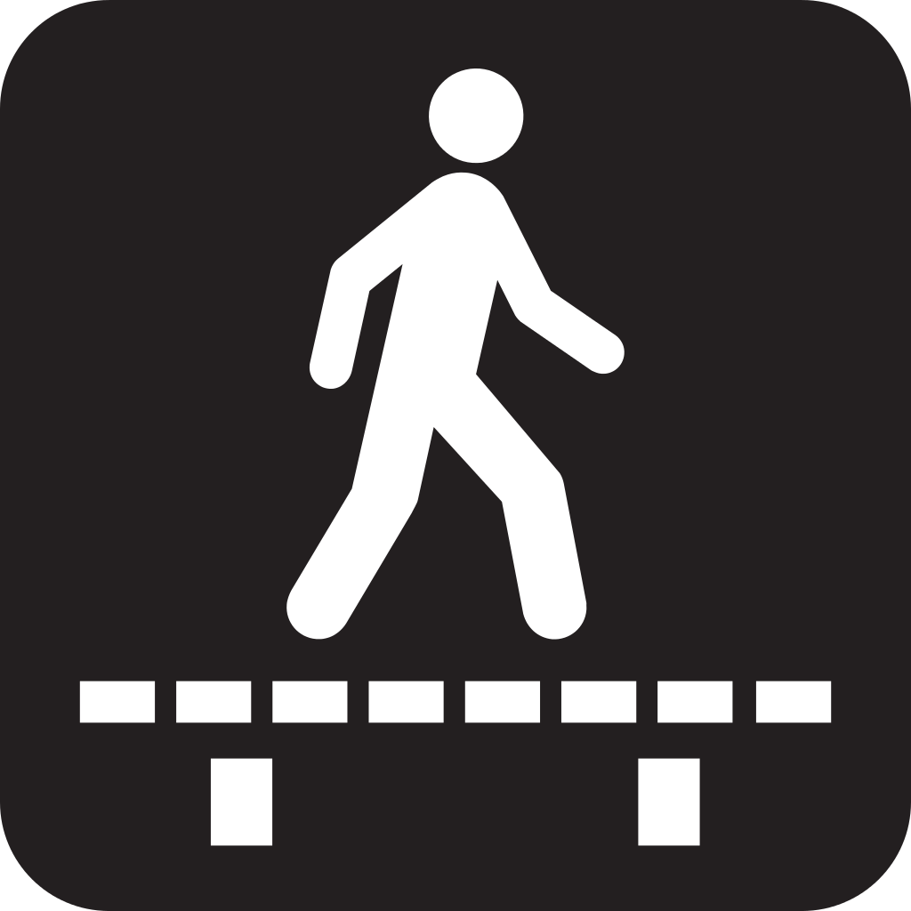
[This Photo](https://creativecommons.org/licenses/by-sa/3.0/)
[CC BY-SA](https://commons.wikimedia.org/wiki/File:Pictograms-nps-misc-walk_on_boardwalk-2.svg)

---
#  Table 1.2: Taxonomy of Motor Skills Based on the Environmental Context Dimension of Gentile’s Two-Dimensions Taxonomy 


```{r tbl20, echo = FALSE}
tbl20 <- tibble::tribble(
~`Stationary Regulatory Conditions`, ~`No intertrial variability.`, ~`Free throws in basketball. Walking in an uncluttered hallway.`,
"Stationary Regulatory Conditions","Inter-trial variability.","Golf shots during a round of golf Taking several drinks of water from the same glass.",
"In-Motion Regulatory Conditions","No inter-trial variability.","Hitting tennis balls projected at the same speed from a ball machine. Walking on a treadmill at a constant speed.",
"In-Motion Regulatory Conditions","Intertrial variability.","Hitting tennis balls during a rally in a game. Walking in a hallway crowded with moving people."
)

kableExtra::kable_styling(knitr::kable(tbl20), font_size = 18)
```

---
#  Gentile’s Taxonomy of Tasks 

+ Function of the action.
	+ Body stability: Skills that involve no change in body location during the performance of the skill.
	+ Body transport: Includes active and passive changes of body locations.
	+ Object manipulation: Maintaining/changing the position of moveable objects.

---
#  Table 1.1: Gentile’s Taxonomy of Motor Skills 


```{r tbl22, echo = FALSE}
tbl22 <- tibble::tribble(
~`Environmental Context`, ~`Intertrial Variability (ITV)`, ~`Body Stability: No Object Manipulation`, ~`Body Stability: Object Manipulation`, ~`Body Transport: No Object Manipulation`, ~`Body Transport: Object Manipulation`,
"Stationary Regulatory Conditions","No ITV","1A","1B","1C","1D",
"Stationary Regulatory Conditions","ITV","2A","2B","2C","2D"
)

kableExtra::kable_styling(knitr::kable(tbl22), font_size = 18)
```

---
#  Table 1.1: Gentile’s Taxonomy of Motor Skills 


```{r tbl23, echo = FALSE}
tbl23 <- tibble::tribble(
~`Environmental Context`, ~`Intertrial Variability (ITV)`, ~`Body Stability: No Object Manipulation`, ~`Body Stability: Object Manipulation`, ~`Body Transport: No Object Manipulation`, ~`Body Transport: Object Manipulation`,
"In-Motion Regulatory Conditions","No ITV","3A","3B","3C","3D",
"In-Motion Regulatory Conditions","ITV","4A","4B","4C","4D"
)

kableExtra::kable_styling(knitr::kable(tbl23), font_size = 18)
```

---
#  How Would You Classify This Task? 

+ Take the time to classify this skill. Once done, move to the next slide.
	+ Is this skill:
	+ Open or closed?
	+ Discrete, continuous or serial?
	+ Fine or gross?
	+ Gentile's taxonomy code?
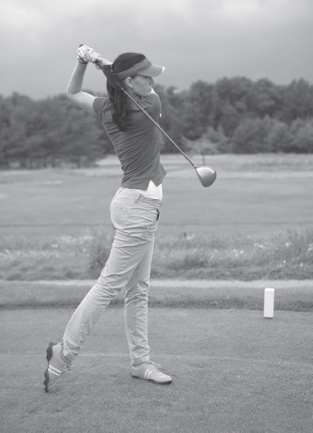

---
#  How Would You Classify This Task? 

+ Take the time to classify this skill. Once done, move to the next slide.
	+ Is this skill:
	+ Open or closed ?
	+ Discrete , continuous or serial?
	+ Fine or gross ?
	+ Gentile's taxonomy code?
	+ 2B
	+ *correct answers are in bold face


---
#  How Would You Classify This Task? 

+ Assume this is a free-throw shooting
	+ So, how would you classify this skill based on the Gentile's taxonomy?
	+ The answer is in the next slide...
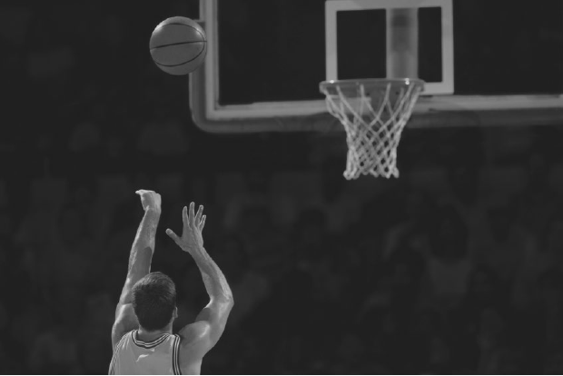

---
#  How Would You Classify This Task? 

+ Assume this is a free-throw shooting
	+ So, how would you classify this skill based on the Gentile's taxonomy?
	+ Answer: 1B
.pull-left[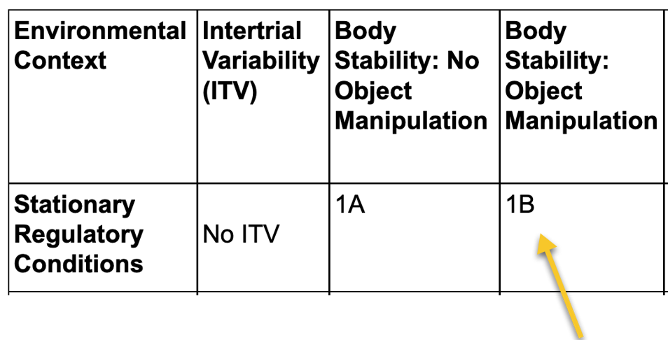]

.pull-right[]

---
#  Characteristics of Gentile’s Taxonomy 

+ Each skill category poses different demands on the performer.
	+ Skills that demand the least of the performer are the simplest; those that demand the most are the most complex.
		+ Skill categories begin at the top leftmost category with the simplest skills and progress to the most complex in the bottom rightmost category.
	+ Environmental context dimension and the action function dimension form the basis for creating sixteen categories of motor skills.

---
#  Practical Application of the Taxonomy 

+ Can be used for evaluating a learner’s movement capabilities and limitations.
	+ Becomes a valuable tool for systematically selecting a progression of functionally appropriate activities to:
		+ Increase person’s performance capabilities.
		+ Help the person overcome his or her performance deficiencies.
	+ Charts a person’ s progress.
		+ Creates a profile of competencies .
